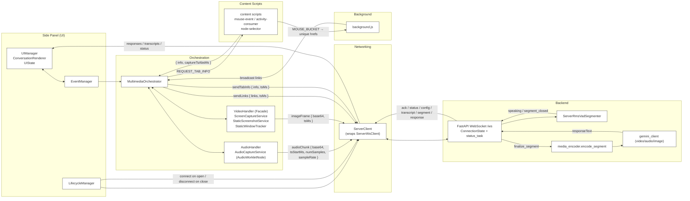

### High-level system architecture

- Extension side panel initializes core managers:
  - UI: `UIManager`, `ConversationRenderer`, `UIState`
  - Control: `EventManager`, `LifecycleManager`
  - Orchestration: `MultimediaOrchestrator` coordinating `AudioHandler` and `VideoHandler`
  - Networking: `ServerClient` wrapping `ServerWsClient`

- Streaming flow:
  - Audio: `AudioWorkletNode` -> PCM base64 -> `audioChunk` to backend with sample-accurate timestamps
  - Video: `captureVisibleTab` -> base64 JPEG -> `imageFrame` to backend first, then preview update
  - Links/Tab Info: content scripts collect links; background rebroadcasts; orchestrator sends `links` and `tabInfo` messages with session-relative timestamps

- Backend:
  - FastAPI WebSocket `/ws` accepts `init`, `imageFrame`, `audioChunk`, `text`, `links`, `tabInfo`, `control`
  - Server VAD segments audio; emits `status` (speaking/segment_closed)
  - Segment finalization encodes video/audio and calls `gemini_client`; server emits `segment`, `transcript`, and `response`

### Flow diagram
The following diagram shows the main components and data flow.

[Mermaid diagram rendered below]

- Key message shapes:
  - Client → Server: `init`, `imageFrame`, `audioChunk`, `text`, `links`, `tabInfo`, `control`
  - Server → Client: `ack`, `status`, `config(captureFps)`, `transcript`, `segment`, `response`, `error`

- Important behaviors:
  - Default capture 1 FPS; server can override via `config.captureFps`
  - Frame send prioritized over preview update
  - Session clock used for consistent timestamps
  - Side panel lifecycle connects on open, disconnects on close

- Optional next steps:
  - Add auto-reconnect/backoff to websocket client
  - Document this diagram in `docs/ARCHITECTURE_SERVER_WS.md` or a new `docs/ARCHITECTURE.v2.md`

### Diagram

If your renderer does not support Mermaid, view the static SVG:

